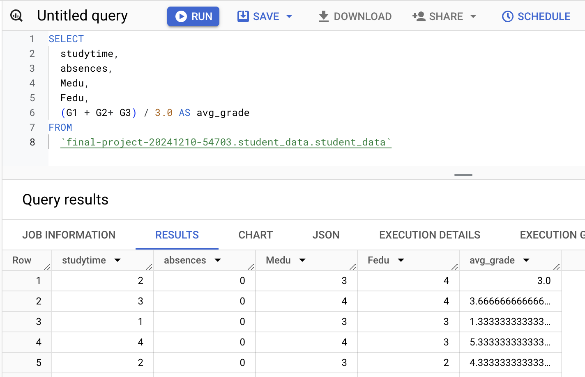
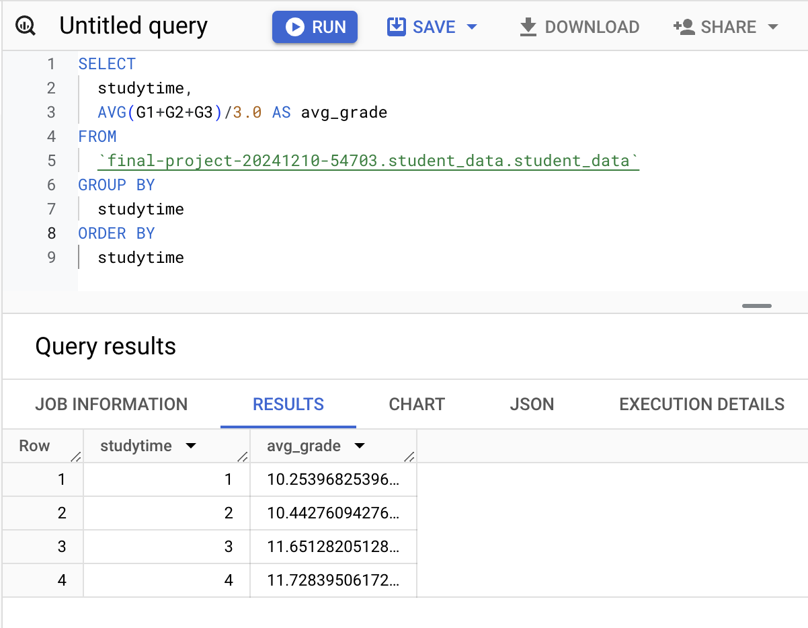
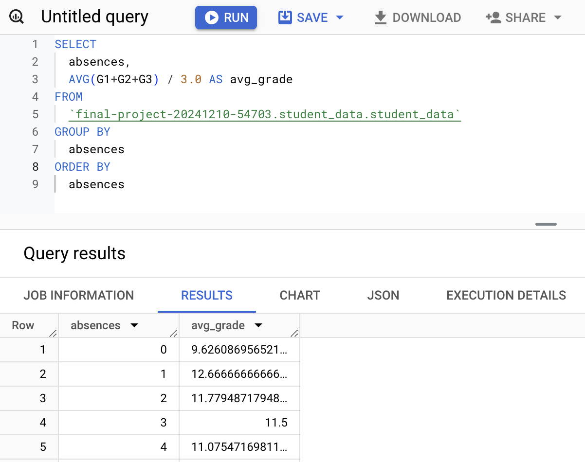
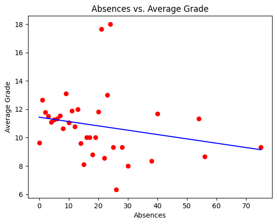
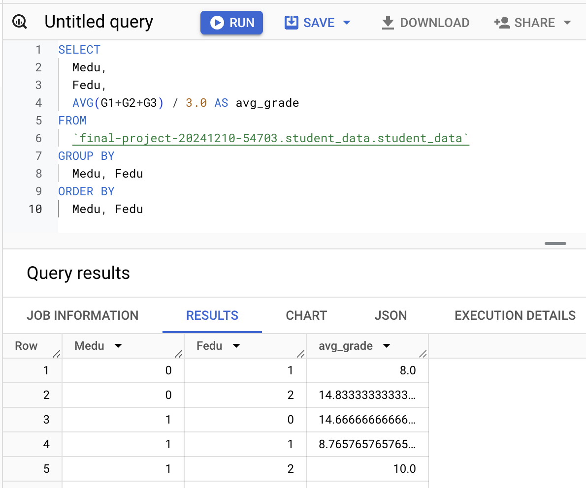
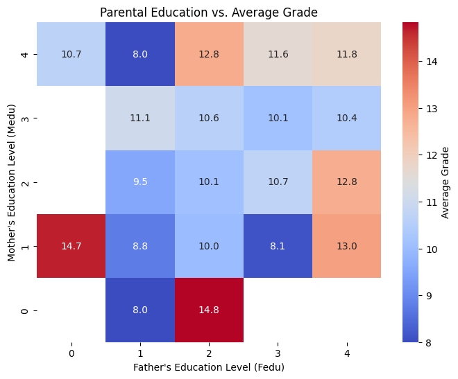

# Analyzing Student Performance Data with BigQuery

## 1. Introduction

### Objective:
The objective of this project is to analyze students' performance using BigQuery.  
The focus is on understanding causes which influence students' performance, visualizing them, and suggesting how we can help them improve their performance.

### Dataset used:
- Student Performance Dataset:  
Obtained in a survey of students' math course in secondary school.  
Contains variable features such as age, gender, grades, etc.  
The whole details are here in the link:  
https://archive.ics.uci.edu/dataset/320/student+performance

## 2. Data Exploration

### Key Findings:
Upon exploring the dataset and just with basic SQLs, I found that there seems to be no specific relationship between gender and the grade each student got.

- Select the number of each gender.

- Select the average grade of each gender.

- Select the top 10 students in the average grade with gender.

## 3. Data Cleaning

### Identify if there is any column which has null value

Here, there is no column which has missing value.

## 4. Data Analysis with Visualization

### Premise: What is student's performance?
Here, I define that student's performance as the average grade they got.
The data has three columns, G1, G2, and G3, which mean the first-period grade, the second, and the final grade.
I will calculate the average of the three, and use it as the student's performance.

### Correlation of Important Factors

#### Here, I focus on the following three factors that might influence student's performance.
    - Study Time 
    - Absence
    - Parent's Educational Level

#### Now, I check the correlation.

- SQL Query:

    

- Visualization:

    

- Findings:  

    - There are slight positive correlations between study time and grade, father education and grade, mother education and grade, and father education and mother education.
    - Absences and avg_grade have a weak negative correlation (-0.0059), implying that a slight increase in absences might be associated with a slightly lower average grade.

#### I will investigate it more deeply in the following sections.

### Objective 1: Analyze the relationship between studytime and the average grade 
#### Hypothesis: Students who spend more time studying tend to perform better.
- SQL Query:

    

- Visualization:

    

- Findings:  
    - This analysis shows a positive correlation between study-time and the average grade, indicating that students studying longer tend to achieve higher grades.

### Objective 2: Analyze the relationship between the number of absence and the average grade 
#### Hypothesis: Students with higher class attendance rates have better overall grades.
- SQL Query:

    

- Visualization:

    

- Findings:  
    - The scatter plot shows a general trend where students with more absences tend to have lower average grades.
    - Most students with high grades (above 14) have fewer than 20 absences.

### Objective 3: Analyze the relationship between the parent's education level and the average grade
#### Hypothesis: Students whose parents had a higher level of education tend to perform better.
- SQL Query:

    

- Visualization:

    

- Findings:  
    - Students with well-educated parents tend to achieve higher grades.
    - Students with Medu = 1, Fedu = 0 and Medu = 0, Fedu = 2 have unexpectedly high grades (14.7 and 14.8), warranting further investigation.

## 5. Conclusion

### Summary
- Students studying longer tend to achieve higher grades.
- Students with more absences tend to have lower average grades.
- Students with well-educated parents tend to achieve higher grades.

### Suggestion
A comprehensive approach is needed because students' academic performance depends on multiple factors, including study time, class participation, and parent's educational level.  
- Study Time
     - Make them motivated to study more and help them be in the habit of studying. For example, by giving them a reward.
- Class Participation
    - Be attentive to reasons for absences, including health and family circumstances. Then address it if any issue exists. Parents and schools would need to work together in that case.
- Parent's Educational Level.
    - Hold workshops and information sessions for parents, providing them with ways to support their children's studies and educational approaches, which may help parents become more actively involved in their children's studies and improve academic outcomes.

## Referece
https://www.kaggle.com/datasets/devansodariya/student-performance-data
https://archive.ics.uci.edu/dataset/320/student+performance