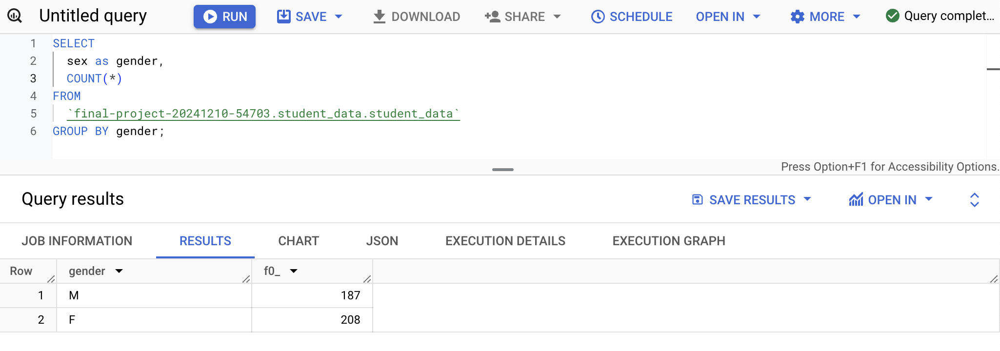
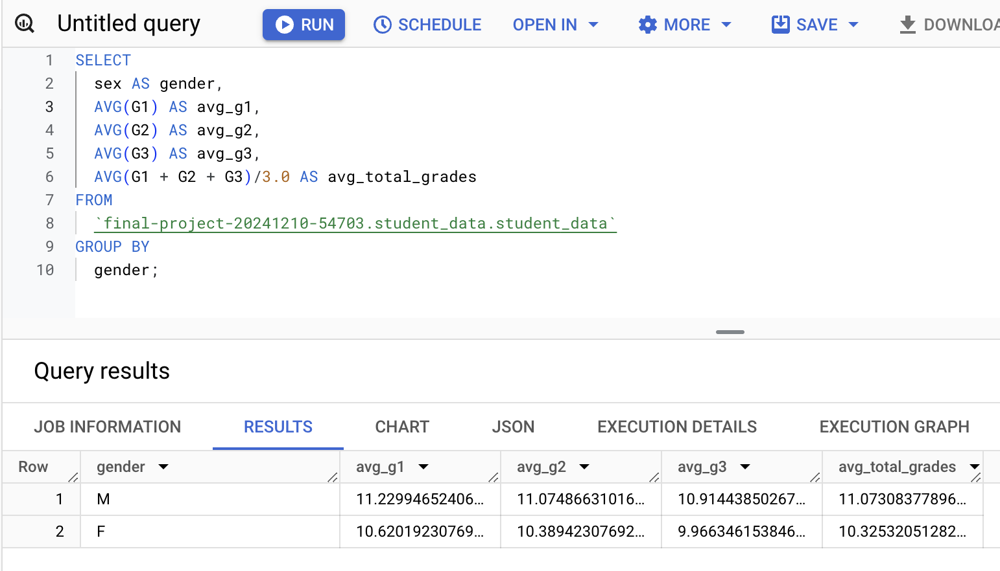
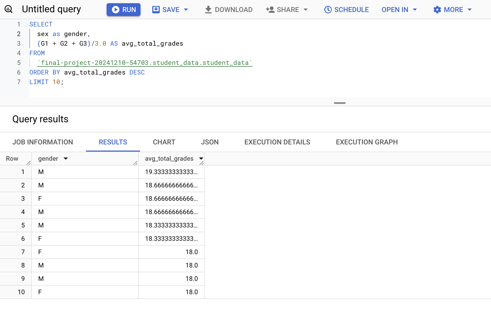
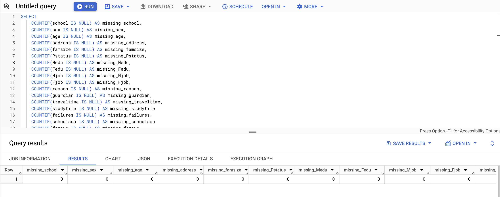
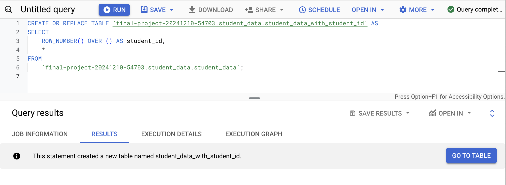
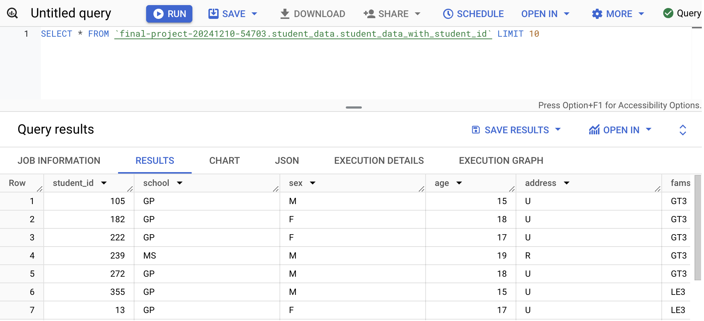
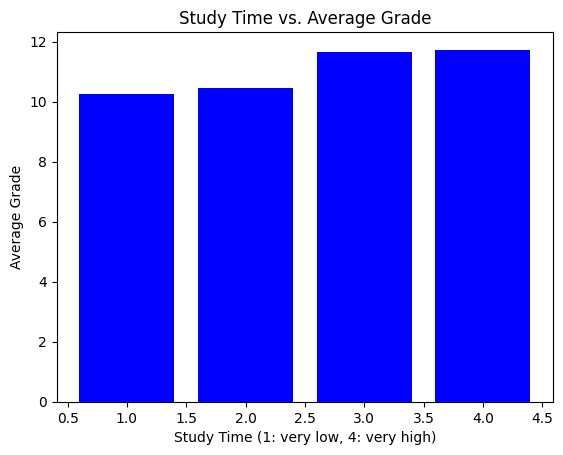

## Introduction

### Objective
The objective of this project is to analyze students' performance using BigQuery.  
The focus is on understanding causes which influence students' performance, visualizing them, and suggesting how we can help them improve their performance.

### Dataset used
- Student Performance Dataset:  
Obtained in a survey of students' math course in secondary school.  
Contains variable features such as age, gender, grades, etc.  
The whole details are here in the link:  
https://archive.ics.uci.edu/dataset/320/student+performance

## Data Exploration

### Key Findings:
Upon exploring the dataset and just with basic SQLs, I found that there seems to be no specific relationship between gender and the grade each student got.

- Select the number of each gender.



- Select the average grade of each gender.



- Select the top 10 students in the average grade with gender.



## Data Cleaning

### 1. Identify if there is any column which has null value
```
SELECT 
    COUNTIF(school IS NULL) AS missing_school,
    COUNTIF(sex IS NULL) AS missing_sex,
    COUNTIF(age IS NULL) AS missing_age,
    COUNTIF(address IS NULL) AS missing_address,
    COUNTIF(famsize IS NULL) AS missing_famsize,
    COUNTIF(Pstatus IS NULL) AS missing_Pstatus,
    COUNTIF(Medu IS NULL) AS missing_Medu,
    COUNTIF(Fedu IS NULL) AS missing_Fedu,
    COUNTIF(Mjob IS NULL) AS missing_Mjob,
    COUNTIF(Fjob IS NULL) AS missing_Fjob,
    COUNTIF(reason IS NULL) AS missing_reason,
    COUNTIF(guardian IS NULL) AS missing_guardian,
    COUNTIF(traveltime IS NULL) AS missing_traveltime,
    COUNTIF(studytime IS NULL) AS missing_studytime,
    COUNTIF(failures IS NULL) AS missing_failures,
    COUNTIF(schoolsup IS NULL) AS missing_schoolsup,
    COUNTIF(famsup IS NULL) AS missing_famsup,
    COUNTIF(paid IS NULL) AS missing_paid,
    COUNTIF(activities IS NULL) AS missing_activities,
    COUNTIF(nursery IS NULL) AS missing_nursery,
    COUNTIF(higher IS NULL) AS missing_higher,
    COUNTIF(internet IS NULL) AS missing_internet,
    COUNTIF(romantic IS NULL) AS missing_romantic,
    COUNTIF(famrel IS NULL) AS missing_famrel,
    COUNTIF(freetime IS NULL) AS missing_freetime,
    COUNTIF(goout IS NULL) AS missing_goout,
    COUNTIF(Dalc IS NULL) AS missing_Dalc,
    COUNTIF(Walc IS NULL) AS missing_Walc,
    COUNTIF(health IS NULL) AS missing_health,
    COUNTIF(absences IS NULL) AS missing_absences,
    COUNTIF(G1 IS NULL) AS missing_G1,
    COUNTIF(G2 IS NULL) AS missing_G2,
    COUNTIF(G3 IS NULL) AS missing_G3
FROM student_data
```


Here, there is no column which has missing value.

### 2. Add new column "student_id" to analyze the data based on each student.


Now, I have a new table with "student_id" column.



## Data Analysis with Visualization


### Objective 1: Analyze the relationship between studytime and the average grade 
#### Hypothesis: Students who spend more time studying tend to perform better.
- SQL Query:

- Visualization:

    

- Findings:  
    - This analysis shows a positive correlation between study-time and the average grade, indicating that students studying longer tend to achieve higher grades.


### Objective 2: Analyze the relationship between the number of absence and the average grade 
#### Hypothesis: Students with higher class attendance rates have better overall grades.
- SQL Query:

- Visualization:


- Findings:  
    - The scatter plot shows a general trend where students with more absences tend to have lower average grades.
    - Most students with high grades (above 14) have fewer than 20 absences.


### Objective 3: Analyze the relationship between the parent's education level and the average grade
#### Hypothesis: Students whose parents had a higher level of education tend to perform better.
- SQL Query:

- Visualization:


- Findings:  
    - Students with well-educated parents tend to achieve higher grades.
    - Students with Medu = 1, Fedu = 0 and Medu = 0, Fedu = 2 have unexpectedly high grades (14.7 and 14.8), warranting further investigation.


## Conclusion

A comprehensive approach is needed because students' academic performance depends on multiple factors, including learning environment, class participation, and home environment.  
Institutions and policy makers should provide special support for students with disadvantaged home environments while helping them manage their study time and improve class participation.